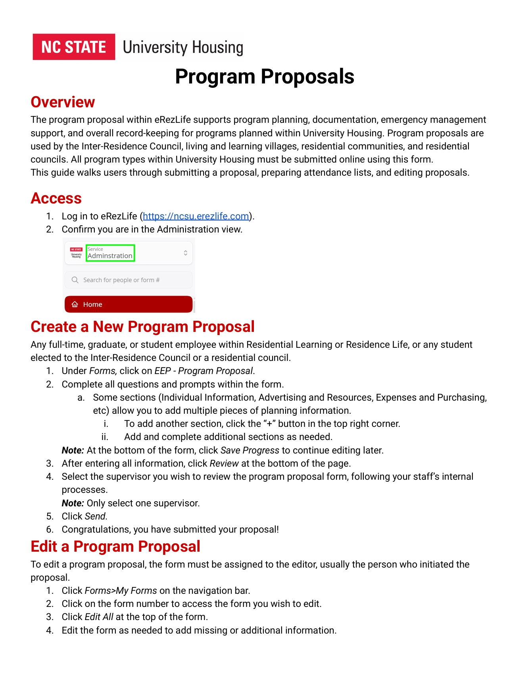
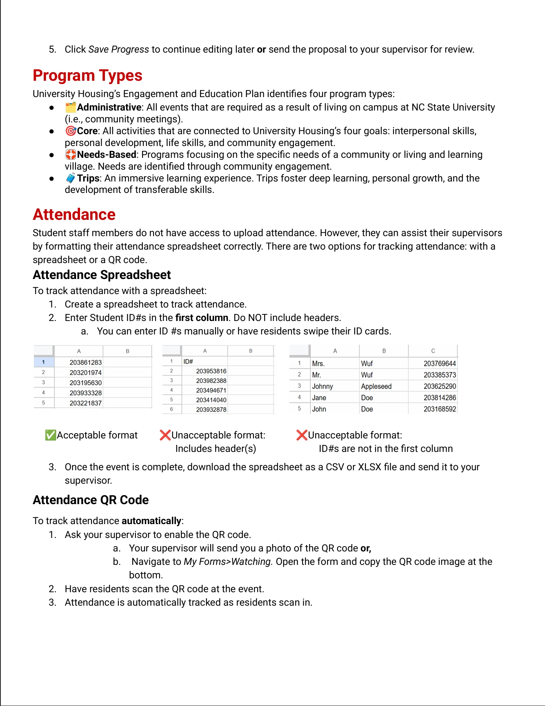

# eRezLife User Guides

## Overview
Designed a structured user guides for student staff using eRezLife software in university housing.

## Audience
- New student staff (first-time users)
- Returning student staff (reference use)
- Professional housing staff (reference use)

## Problem
Existing documentation was inconsistent, difficult to navigate, and not aligned with user workflows.

## My Role
- Conducted user analysis
- Designed content structure
- Wrote and organized user guides

## Documentation Strategy
- Task-based guides (how to complete key workflows)
- Modular structure for quick reference
- Consistent formatting and terminology

## Sample Guides
- Program proposal submission and workflow
- PackChat form submission

## Outcomes
- Improved usability and learnability
- Reduced onboarding friction

## Program Proposal Guide

